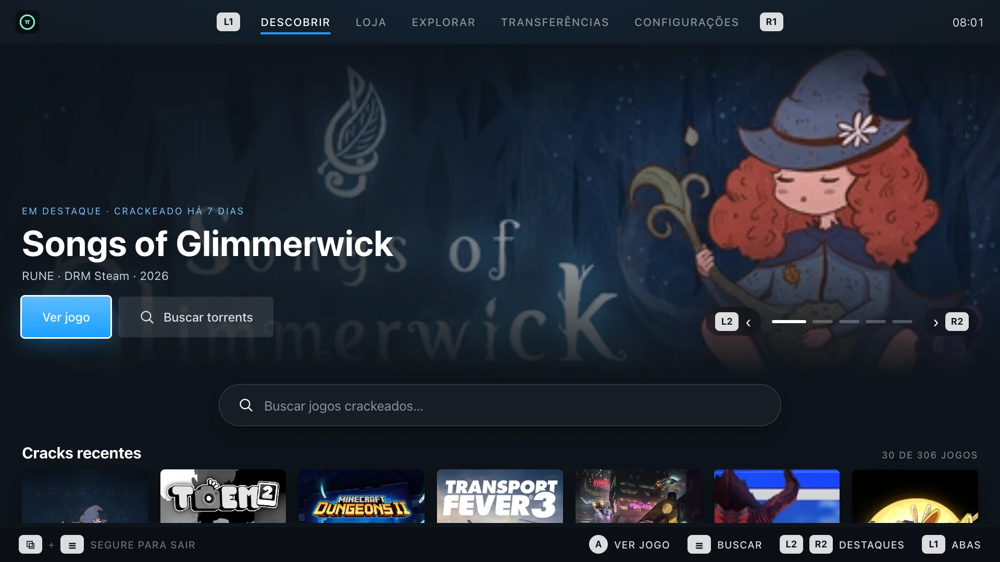

<p align="center">
  
</p>

<h1 align="center">piShop</h1>

<p align="center">
  <b>Seu hub de jogos dentro do Modo de Jogo do SteamOS.</b><br/>
  <i>Your game hub, right inside SteamOS Gaming Mode.</i><br/><br/>
  <a href="https://anarqz.github.io/pishop/">Site</a> ·
  <a href="https://anarqz.github.io/pishop/?lang=en">Website (EN)</a> ·
  <a href="https://github.com/anarqz/pishop/releases">Releases</a>
</p>

<p align="center">
  
</p>

---

## Instalação · Install

No **Modo Desktop**, abra o **Konsole** e cole:
*In **Desktop Mode**, open **Konsole** and paste:*

```bash
curl -fsSL https://anarqz.github.io/pishop/install.sh | bash
```

Volte ao **Modo de Jogo** → Biblioteca → **Não-Steam** → **piShop**.
Rodar o mesmo comando de novo atualiza o app.
*Back to **Gaming Mode** → Library → **Non-Steam** → **piShop**. Running the command again updates it.*

Desinstalar · Uninstall:

```bash
curl -fsSL https://anarqz.github.io/pishop/install.sh | bash -s -- --uninstall
```

Nada é instalado no sistema: tudo fica em `~/Applications/piShop` e `~/.local/share/piShop`.
*Nothing is installed system-wide: everything lives in `~/Applications/piShop` and `~/.local/share/piShop`.*

## O que é · What it is

Um app nativo para SteamOS (Steam Deck, ROG Ally, Legion Go…) feito para o controle:

- **Descobrir** — lançamentos e cracks recentes em visual Big Picture, página do jogo com trailer, sinopse (Steam / TheGamesDB) e arte (SteamGridDB).
- **Loja** — busca nos indexadores do seu Prowlarr, com detalhes do torrent e download direto para `roms/<sistema>`.
- **BitTorrent nativo** — TCP/uTP, DHT, retomada e streaming de vídeo.
- **Explorar** — compartilhamentos de rede (SMB) num explorador de dois painéis, com fila de cópias para o aparelho.
- **Interface SteamOS** — abas em L1/R1, legenda de botões, analógico direito para rolar, teclado da Steam sob demanda, escala automática (Deck / Ally / TV).

A lista completa, incluindo o que está em estudo, está no [site](https://anarqz.github.io/pishop/#features).

## Desenvolvimento · Development

| Parte | Stack |
|---|---|
| `launcher/` | Rust (axum, librqbit, smb — com patches em `launcher/vendor/`) |
| `web/` | React + Vite (PWA embutida no binário) |
| `docs/` | Site (GitHub Pages) e `install.sh` |
| `scripts/` | `build.sh` (bundle local), `deploy.sh` (copia para o aparelho via SSH) |

```bash
./scripts/build.sh                                   # dist/piShop (Chromium incluído)
DECK=deck@steamdeck.local DECK_PASS=… ./scripts/deploy.sh --install
```

Releases: `git tag v0.1.0 && git push --tags` (ou *Actions → Release → Run workflow*).

## Aviso · Disclaimer

O piShop não hospeda, indexa nem distribui conteúdo. Ele se conecta a serviços que **você** configura (Prowlarr, armazenamento de rede, APIs públicas). Use apenas com conteúdo que você tem o direito de baixar.
*piShop does not host, index or distribute any content. It connects to services **you** configure. Only use it with content you have the right to download.*
